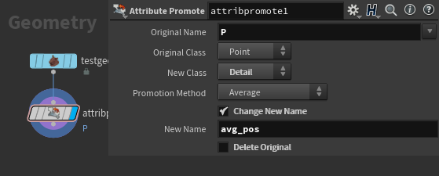
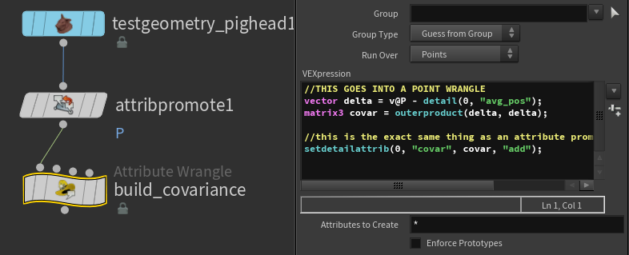
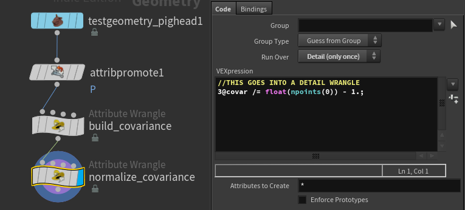
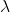
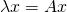

# houdini_black_magic
some serious voodo bruh. 
This is going to eventually become a lot of contributions to the advanced section on the community site :o
Right now it's quite unprofessionally written and has not been proofread at all.


This is honestly like stuff you should only whip out when trying to impress a honey u kno? 

## EXAMPLE 1 - WRITING VEX WITH PYTHON
SLAP DOWN TWO WRANGLES BOOYYYYYYYYYYYYY. It's easy to miss that the VEXpression section of a wrangle is actually just a parameter like any string parameter, just thiccer. So like any string parameter, you can use hscript orr python. Take a second and let that sink in, python.

### IN WRANGLE #1 RUNNING OVER POINTS:
```c
float r = rand(@ptnum) * 3;
r = floor(r);

if(r == 0) s@class = "a";
if(r == 1) s@class = "b";
if(r == 2) s@class = "c";

f@val;
```


### IN WRANGLE #2 RUNNING OVER DETAILS:

Right click you vexpression and drop down a keyframe and set the vexpression language to python. BOOM we're in. 
Like any python expression you need to return your result. So any string we return that contains vex code will get executed by this parameter.

```py
node = hou.pwd()
input = node.inputs()
geo = input[0].geometry()
points = geo.points()

#define our functions
out = """
float aa(float i){ 
    return pow(i, 2); 
}
float ab(float i){ 
    return exp(i); 
}
float ac(float i){ 
    return sqrt(i);
} \n"""

out += "float val;\n"

for i, point in enumerate(points):
	#class attribute drives which function is selected. 
    out += "val = a%s(10);\n" % (point.attribValue("class"))
    out += "setpointattrib(0, 'val', %d, val);\n" % i

return out
   
```


### WHAT DOES THIS EVEN DOOOOOO. ANSWER: NOTHING!. 
All it does is show how you can dynamically complete VEX expressions with python, notice how im filling in the suffix of the function name in the first line of code in the for loop?

This line specifically: `out += "val = a%s(10);\n" % (point.attribValue("class"))`

If you want to see the vex this outputs just click on the VEXpression parm and boom you can see what this outputs. wowowowowowow.
I only have 4 points in this example, so here's what that would look like when it gets parsed:

```c
    float aa(float i){ 
        return pow(i, 2); 
    }
    float ab(float i){ 
        return exp(i); 
    }
    float ac(float i){ 
        return sqrt(i);
    } 
float val;
val = ab(10);
setpointattrib(0, 'val', 0, val);
val = aa(10);
setpointattrib(0, 'val', 1, val);
val = ac(10);
setpointattrib(0, 'val', 2, val);
val = aa(10);
setpointattrib(0, 'val', 3, val);
```
BAM DONE. NEXT!


## EXAMPLE 2 - The Covariance Matrix/PCA

Hello my dudes. Prior knowledge needed for this is defo like linear algebra, and maybe a bit of statistics. Covariance is a concept that comes up all over the place in the land of statistics and higher levels of math. With the extention of PCA (principal component analysis) we can turn covariance into a powerhouse of a tool that can be used for solving all types of problems, from adding normals to a point cloud, to creating an oriented bounding box for a given object.

If you don't care to understand how this works, just scroll to the bottom, but just know that i h8 u for it :(

Like always we'll be using Houdini and it's internal scripting language, VEX for this.

To understand Covariance, you must first understand variance. At it's core variance is all about finding the squared delta (difference) of a variable to it's mean. Or in more readable terms, what's the average distance from any sample in a data set, to it's average.

In a 1 dimensional system, where X is some random variable with *n* samples, variance is defined as this:


Where  is the mean of our data set defined by:


As a refresher, let's start by just doing the variance of the X axis of a given input object.

### So let's drop down a pighead and then a wrangle in detail mode.

```c
//THIS GOES INTO A DETAIL WRANGLE
float xavg(int input){
	float avg = 0;
	for(int i = 0; i < npoints(input); i++){
		float x = point(input, "P", i)[0];
		avg += x;
	}
	return avg / float(npoints(input));
}

@xavg = xavg(0);
```

Again since the prior knowledge asks for linear algebra, I'll assume you understand how to calculate the average of a data set...

From here all we need to is calculate the squared distance from a given sample to the average, sum that up over all samples and divide out our sample size to normalize it!

```c
//THIS GOES INTO A DETAIL WRANGLE
float xvariance(int input){
	float avg = xavg(input);
	float variance = 0;
	
	int n = npoints(input);
	
	for(int j = 0; j < n; j++){
		float x = point(input, "P", i)[0];
		x = x - avg;
		x = x * x;

		variance += x;
	}

	return variance / float(n);
}

@xvariance = xvariance(0);
```


Alright bubs we're inching ever closer, now what is covariance. Variance is a one dimensional test, therefore Covariance is the same test but over two dimensions. Or in other words, given two variables how do they collectively vary from their respective averages.

An easy way to think about this, is we want to know how well two variables correspond in terms of variation from the mean. So in the case of a covariance of 0, the variables don't correspond at all. The larger the covariance, the more one can assume the two variables correspond. Covariance can be negative as well, that would indicate anticorrelation, however for the sake of brevity, let's not dive down the statistical rabit hole...

Where X and Y are two random variables with *n* samples in each, and the function `E()` is the average of a given variable, covariance can be expressed as so:


This is all probably easier to see in code....


```c
//THIS GOES INTO A DETAIL WRANGLE
vector pos_avg(int input){
	vector avg = 0;
	for(int i = 0; i < npoints(input); i++){
		vector a = point(input, "P", i);
		avg += a;
	}
	return avg / float(npoints(input));
}

//WHERE A and B are the vector components you want to test against
float covar(int input, int a, int b){
	float a_avg = pos_avg(input)[a];
	float b_avg = pos_avg(input)[b];
	float covariance = 0;

	int n = npoints(input);

	for(int j = 0; j < n; j++){
		vector p = point(input, "P", i);
		
		float x = p[a];
		float y = p[b];

		x = x - a_avg;
		y = y - b_avg;

		//x * y instead of x * x
		x = x * y;

		covariance += x;
	}

	return covariance / (float(n) - 1);
}
//covariance between the X and Y axis
@covariance = covariance(0, 0, 1);
```

But wait, why am i subtracting one from our total point count when returning covariance and not variance... The math equation above doesn't subtract one either... This has to do with unbiased vs biased estimates of covariance which again is more statistics bullshit. So for now just roll with it...

If you demand an explanation, a good place to start would be this tutorial, at the bottom of page 3! 
http://www.cs.otago.ac.nz/cosc453/student_tutorials/principal_components.pdf

We work in 3d, and the above code is for a two dimensional variance anylysis, so that's not entirely helpful. And not only that, it's not really a full description of the variance in that data set, as we need to take into account the variance on each dimension seperately as well! What we really need is a matrix of covariance. The below code block is what a basic covariance matrix looks like with the functions we defined above.

```c
...

//a sample covariance matrix

int x = 0, y = 1, z = 2;

matrix3 covar = 
set(covar(0, x, x), covar(0, x, y), covar(0, x, z),
 	covar(0, y, x), covar(0, y, y), covar(0, y, z),
	covar(0, z, x), covar(0, z, y), covar(0, z, z))
```

And that's really it! However all that vex code looks ugly, so let's rebuild this in a cuter way.

### COVARIANCE MATRICES AND DOING THIS WHOLE TING SMARTER 

The above matrix is really interesting for a few reasons, but the most important one for us is the fact that its symmetric along the diagonal. Meaning if we rethink our above code in a more clever way, we can build **OUR FULL COVARIANCE MATRIX** in a way that's so much more elegant in execution.

First step is to find the average position of our mesh, for that a simple attribute promote from point `P` to a detail attribute will work.



Next we need to get the delta from our position to the average so we can start building the covariance matrix

```c
//THIS GOES INTO A POINT WRANGLE
vector delta = v@P - detail(0, "avg_pos");
```


The next part is where things get fun, if you think about the definition of the outer product operator, you might come to realize that if you take the outer product of a vector and its' transpose you're left with a symmetric matrix. Here's a visual to help:

```c
vector A;
outerproduct(A, A) ==

[A.x * A.x, A.x * A.y, A.x * A.z]
[A.y * A.x, A.y * A.y, A.y * A.z]
[A.z * A.x, A.z * A.y, A.z * A.z]
```

Well that's convenient, since we already know a core part of variance is that it's the squared distance to the mean, over the number of samples minus 1. And if we substitute our delta (the distance from our sample to the mean) for A in the above outerproduct example, you'll see it creates a matrix of partially solved variance results. The final things we then need to do to make it correct are:
* sum this matrix up over all points in the mesh, like we do in our previous examples!
* then, we can divide out the number of points minus one from the sum, as discussed before.


```c
//THIS GOES INTO A POINT WRANGLE
vector delta = v@P - detail(0, "avg_pos");
matrix3 covar = outerproduct(delta, delta);

//this is the exact same thing as an attribute promotion in add mode!
setdetailattrib(0, "covar", covar, "add");

```




```c
//THIS GOES INTO A DETAIL WRANGLE
3@covar /= float(npoints(0)) - 1.;
```



That's so much cleaner. I love you math.


### Introduction to Eigen Vectors and Values

Eigen vectors are not the easiest subject to broach, but principal component analysis is to me the simplest and most straightforward example of a practical application of them.

An eigen vector is simply a vector which when transformed by the matrix it corresponds with (the one we extracted it from), it does nothing but uniformly scales. The amount it scales, is known as the eigen value. In math terms, where A is our input matrix, x is our eigen vector, and  is our eigen value.



Eigen vectors and values have far more properties than that, but since this is our intro, let's hold off on that... For higher dimensional problems or problems with non real eigen vectors, this definition is not the easiest to visualize, but since our problem is 3 dimensional, it's incredibly easy for us to visualize! Keep in mind that an NxN matrix will have N eigen vectors, so for our 3x3 matrix, we should expect 3 eigen vectors.

So then how does that apply to our covariance matrix? Well some smart people realized that the first, or largest, eigen vector of a covariance matrix, corresponds to the vector direction with the greatest amount of variance. And all subsequent **orthogonal** eigen vectors, will correspond to the vector direction with the next highest level of variance. 

Luckily for us we've ensured our eigen vectors will be orthogonal, due to the fact that a symmetric matrix will always have orthogonal eigen vectors. I'm not going to prove why that is, if you want more insite into that, check out this paper: http://www.quandt.com/papers/basicmatrixtheorems.pdf, (Theorem 2.)

I think we're ready to start solving for some eigen vectors. There are tons of different ways to extract the eigen vectors from a matrix, but since this our intro we're going to take the simplest approach Power Iteration. 

### Power iteration is fuckin easy.

Below is a step by step breakdown of the algorithm, but in a single sentence we basically just take a random vector, and multiply it by the matrix whose eigen vector we're trying to solve for, over and over until it converges to an eigenvector. However this alone isn't enough, as the resulting vector will be scaled by the input matrix, so we need to normalize it at each iteration to prevent it from tending off to infinity, or shrinking to zero. 

And now in code form:
```c
vector power_iteration(matrix3 m){
	//some random vector
	vector x = rand(set(1, 5, 2));

	vector y = x;

	//num of iterations to run over
	int iterations = 100;

	for(int i = 0; i < iterations; i++){
		y *= m;
		y = normalize(y);
	}
	return y;
}
```

One more thing to note, is that you can (and should) test for convergence to the eigen vector, meaning if the normalized and transformed vector from the current iteration, isnt all that different from the previous iterations vector, break the loop!

```c
vector power_iteration(matrix3 m){
	vector x = rand(set(1, 5, 2));
	vector y = x;
	int iterations = 100;

	vector last_vect = y;
	float epsilon = 1e-5;
	for(int i = 0; i < iterations; i++){
		last_vect = y;

		y *= m;
		y = normalize(y);

		if(dot(last_vect, y) < epsilon) break;
	}
	return y;
}
```
Boom you've mastered power iteration (well not really, you're still a scrub tbh, I'll fight you).

It's really that simple. Another thing to note is that this will only solve for our largest eigen vector. If we want to solve for all eigen vectors in one operation, we can use Singular Value Decomposition or some other eigen solver (not that you cant use power iteration in your SVD algo). But since we're lazy, and this post is long enough as it is, let's just use inverse iteration. If power iteration is solving by multiplying by our input matrix, inverse iteration is the exact same process, but with the inverse of our input matrix.

```c
vector inverse_iteration(matrix3 m){
	vector x = rand(set(1, 5, 2));
	vector y = x;
	int iterations = 100;

	vector last_vect = y;
	float epsilon = 1e-5;

	for(int i = 0; i < iterations; i++){
		y *= invert(m);
		y = normalize(y);

		if(dot(last_vect, y) < epsilon) break;
	}
	return y;
}
```

This will return our smallest eigen vector, and since this is 3 dimensions and the final eigen vectors have to be orthogonal, we can make the assumption that our final unknown is the cross product between those two solved eigen vectors!

With all that in mind, let's do it for our covariance matrix, and see what kind of output we get.
```c

vector inverse_iteration(matrix3 m){
	vector x = rand(set(1, 5, 2));
	vector y = x;
	int iterations = 100;

	vector last_vect = y;
	float epsilon = 1e-5;
	
	for(int i = 0; i < iterations; i++){
		y *= invert(m);
		y = normalize(y);

		if(dot(last_vect, y) < epsilon) break;
	}
	return y;
}


vector power_iteration(matrix3 m){
	vector x = rand(set(1, 5, 2));
	vector y = x;
	int iterations = 100;

	vector last_vect = y;
	float epsilon = 1e-5;
	for(int i = 0; i < iterations; i++){
		last_vect = y;

		y *= m;
		y = normalize(y);

		if(dot(last_vect, y) < epsilon) break;
	}
	return y;
}


v@x = power_iteration(3@covar);
v@y = inverse_iteration(3@covar);
v@z = cross(v@x, v@y);
```

Finally if we want to use this for the purposes of an oriented bounding box, then we need the eigen vectors to have lengths equal to their corresponding eigen values. If we refer back to this equation:

then you'll note that we only need to transform our eigen vectors by our input matrix, to achieve that result.

So finally our oriented bounding box is defined by this matrix result!

```c
...

v@x = power_iteration(3@covar);
v@y = inverse_iteration(3@covar);
v@z = cross(v@x, v@y);

v@x *= 3@covar;
v@y *= 3@covar;
v@z *= 3@covar;


3@bounding_box = set(v@x, v@y, v@z);
```


### FINAL DISCLAIMER

Power iteration is pretty unstable, and the input random vector's sign will affect the output eigen vector's sign. This will cause weird bounding box flipping depending, if you were expecting this to work on animated inputs.
The MIT PDF i've linked below offers one potential solution for that. I'm going to make a follow up to this post discussing how you can use a spanning tree to re-orient the components, in the case PCA is used to describe point-cloud normals.

Please post up any and all comments/questions! I'd love to hear what ya'll think about this post.
<3 <3 <3

REFERENCES:
http://www.cs.otago.ac.nz/cosc453/student_tutorials/principal_components.pdf
https://jeremykun.com/2012/06/28/principal-component-analysis/
http://web.mit.edu/18.06/www/Spring17/Power-Method.pdf
http://www.quandt.com/papers/basicmatrixtheorems.pdf