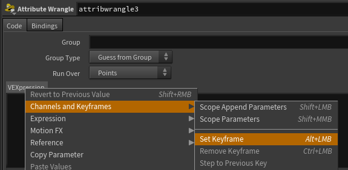
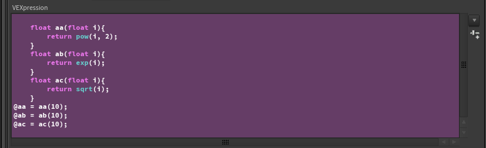
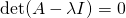
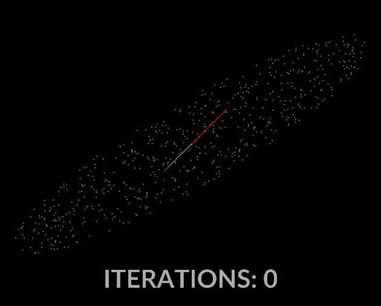
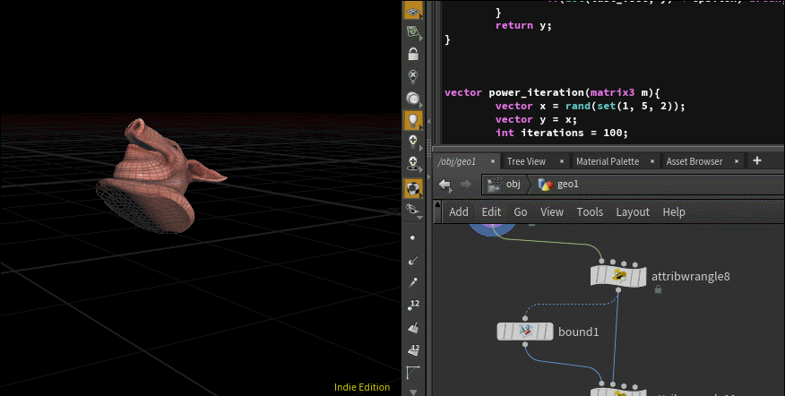
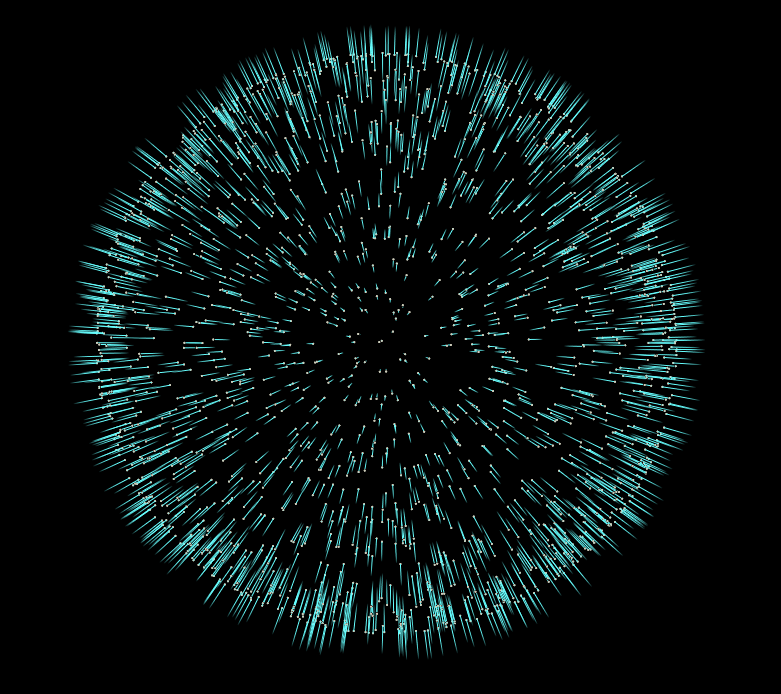
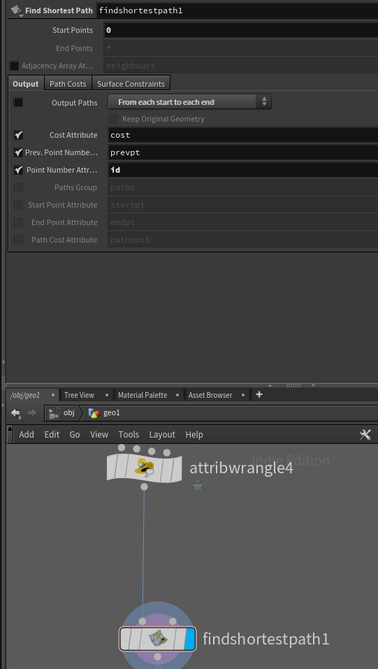

# houdini_black_magic
some serious voodo bruh. 
This is going to eventually become a lot of contributions to the advanced section on the community site :o
Right now it's quite unprofessionally written and has not been proofread at all.


This is honestly like stuff you should only whip out when trying to impress a honey u kno? 

## EXAMPLE 1 - WRITING VEX WITH PYTHON
SLAP DOWN A WRANGLE BOOYYYYYYYYYYYYY. It's easy to miss that the VEXpression section of a wrangle is actually just a parameter like any string parameter, just thiccer. So like any string parameter, you can use hscript or python. Take a second and let that sink in, python.

### IN ANY TYPE OF WRANGLE

Right click your VEXpression parm, drop down a keyframe and set the vexpression language to python. BOOM we're in. You'll know it's working because the text box will turn purple.



Like any python expression you need to return your result. So any string we return that contains vex code will get executed by this parameter.

```py
#define our functions
out = """
float aa(float i){ 
    return pow(i, 2); 
}
float ab(float i){ 
    return exp(i); 
}
float ac(float i){ 
    return sqrt(i);
} \n"""

#define our class suffixes
classes = "abc"

for class_name in classes:
    #create a new attribute with the class name and output
    #use .format() instead of % cuz that's the newer convention for string replacement.
    out += "@a{0} = a{0}(10);\n".format(class_name)

return out
   
```


### WHAT DOES THIS EVEN DOOOOOO. ANSWER: NOTHING!
We're basically using python to generate a few functions, and then we return a unique attribute based on the called function's name!

This line specifically: `out += "@a{0} = a{0}(10);\n".format(class_name)` both chooses the function to call, and stores it's value in a uniquely named attribute! Again, this is just outputting vex code, so if you click on the VEXpression parm, you'll see the output vex! Neat!!!!!



Though I can't say the formatting is incredible on the output vex... ;)


## EXAMPLE 2 - The Covariance Matrix/PCA

Hello my dudes. Prior knowledge needed for this is defo like linear algebra, and maybe a bit of statistics. Covariance is a concept that comes up all over the place in the land of statistics and higher levels of math. With the extention of PCA (principal component analysis) we can turn covariance into a powerhouse of a tool that can be used for solving all types of problems, from adding normals to a point cloud, to creating an oriented bounding box for a given object.

We're going to cover two examples in this walk through, first starting with an oriented bounding box example, and then we'll be moving on to a much more interesting example in my opinion, adding normals to a point cloud. 

Like always we'll be using Houdini and it's internal scripting language, VEX for this.

To understand Covariance, you must first understand variance. At it's core variance is all about finding the squared delta/error (difference) of a variable to it's mean. Or in more readable terms, what's the average distance from any sample in a data set, to the average of the data set.

In a 1 dimensional system, where X is some random variable with *n* samples, variance is defined as this:


Where  is the mean of our data set defined by:


As a refresher, let's start by just doing the variance of the X axis of a given input object.

### So let's drop down a pighead and then a wrangle in detail mode.

```c
//THIS GOES INTO A DETAIL WRANGLE
float xavg(int input){
	float avg = 0;
	for(int i = 0; i < npoints(input); i++){
		float x = point(input, "P", i)[0];
		avg += x;
	}
	return avg / float(npoints(input));
}

@xavg = xavg(0);
```

Again since the prior knowledge asks for linear algebra, I'll assume you understand how to calculate the average of a data set...

From here all we need to is calculate the squared distance from a given sample to the average, sum that up over all samples and divide out our sample size to normalize it!

```c
//THIS GOES INTO A DETAIL WRANGLE
float xvariance(int input){
	float avg = xavg(input);
	float variance = 0;
	
	int n = npoints(input);
	
	for(int j = 0; j < n; j++){
		float x = point(input, "P", i)[0];
		x = x - avg;
		x = x * x;

		variance += x;
	}

	return variance * (1 / float(n));
}

@xvariance = xvariance(0);
```


Alright bubs we're inching ever closer, now what is covariance. Variance is a one dimensional test, therefore Covariance is the same test but over two dimensions. Or in other words, given two variables how do they collectively vary from their respective averages.

An easy way to think about this, is we want to know how well two variables correspond in terms of variation from the mean. So in the case of a covariance of 0, the variables don't correspond at all. The larger the covariance, the more one can assume the two variables correspond. Covariance can be negative as well, that would indicate anticorrelation, however for the sake of brevity, let's not dive down the statistical rabit hole...

Where X and Y are two random variables with *n* samples in each, and the function `E()` is the average of a given variable, covariance can be expressed as so:


This is all probably easier to see in code....


```c
//THIS GOES INTO A DETAIL WRANGLE
vector pos_avg(int input){
	vector avg = 0;
	for(int i = 0; i < npoints(input); i++){
		vector a = point(input, "P", i);
		avg += a;
	}
	return avg / float(npoints(input));
}

//WHERE A and B are the vector components you want to test against
float covar(int input, int a, int b){
	float a_avg = pos_avg(input)[a];
	float b_avg = pos_avg(input)[b];
	float covariance = 0;

	int n = npoints(input);

	for(int j = 0; j < n; j++){
		vector p = point(input, "P", i);
		
		float x = p[a];
		float y = p[b];

		x = x - a_avg;
		y = y - b_avg;

		//x * y instead of x * x
		x = x * y;

		covariance += x;
	}

	return covariance * (1  / float(n));
}
//covariance between the X and Y axis
@covariance = covariance(0, 0, 1);
```

This isn't entirely essential, but I'd like to take a moment to introduce the topic of biased covariance vs unbiased covariance. If you look at our last operation in the covar function, `return covariance * (1  / float(n));` we're doing what's known as unbiased estimate of our point cloud's covariance. What I mean by unbiased is that because we know the true mean of our data set, we have no need to correct for potential error that could arise from an incomplete data set. Why is this important? Well for our purposes it's not terribly impactful, however there may arrise a cause where you need to calculate the variance of a data set so large that the true mean is not realistically obtainable. In such a case it would make sense to take a few random samplings of the data set to calculate your variance and mean values from. However because of the randomness of the sampling and the fact that we're estimating over a small subset of data points, you run the risk of calculating a variance value or even a mean value that strays far from the true mean of the data set. The way to correct for this is known as Bessel's Correction. In code that would look like this: `return covariance * (1  / (float(n) - 1));` If you want a numbers perspective on this, I've found the wikipedia on the subject to be full of interesting examples: https://en.wikipedia.org/wiki/Bessel%27s_correction#Source_of_bias


Moving on, the above covariance estimate doesn't really give us a complete picture of the total variance in the system. It only shows the covariance between our X and Y axes. However we're trying to find a meaningful way to represent the covariance of the entire data set, over all dimensions spanned by the data set. For that we should construct a matrix of variance, that spans all of our given dimensions:
```c
...

//a sample covariance matrix

int x = 0, y = 1, z = 2;

matrix3 covar = 
set(covar(0, x, x), covar(0, x, y), covar(0, x, z),
 	covar(0, y, x), covar(0, y, y), covar(0, y, z),
	covar(0, z, x), covar(0, z, y), covar(0, z, z))
```

And that's really it! However all that vex code looks ugly, so let's rebuild this in a cuter way.

### COVARIANCE MATRICES AND DOING THIS WHOLE TING SMARTER 

The above matrix is really interesting for a few reasons, but the most important one for us is the fact that its symmetric along the diagonal. Meaning if we rethink our above code in a more clever way, we can build **OUR FULL COVARIANCE MATRIX** in a way that's so much more elegant in execution.

First step is to find the average position of our mesh, for that a simple attribute promote from point `P` to a detail attribute will work.


Next we need to get the delta from our position to the average so we can start building the covariance matrix

```c
//THIS GOES INTO A POINT WRANGLE
vector delta = v@P - detail(0, "avg_pos");
```


The next part is where things get fun, if you think about the definition of the outer product operator, you might come to realize that if you take the outer product of a vector and its' transpose you're left with a symmetric matrix. Here's a visual to help:

```c
vector A;
outerproduct(A, A) ==

[A.x * A.x, A.x * A.y, A.x * A.z]
[A.y * A.x, A.y * A.y, A.y * A.z]
[A.z * A.x, A.z * A.y, A.z * A.z]
```

Well that's convenient, since we already know a core part of variance is that it's the squared distance to the mean, over the number of samples minus 1. And if we substitute our delta (the distance from our sample to the mean) for A in the above outerproduct example, you'll see it creates a matrix of partially solved variance results. The final things we then need to do to make it correct are:
* sum this matrix up over all points in the mesh, like we do in our previous examples!
* then, we can divide out the number of points minus one from the sum, as discussed before.


```c
//THIS GOES INTO A POINT WRANGLE
vector delta = v@P - detail(0, "avg_pos");
matrix3 covar = outerproduct(delta, delta);

//this is the exact same thing as an attribute promotion in add mode!
setdetailattrib(0, "covar", covar, "add");

```


```c
//THIS GOES INTO A DETAIL WRANGLE
3@covar /= float(npoints(0)) - 1.;
```


That's so much cleaner. I love you math.

But we should take a step back, now that we have the covariance matrix, what does that actually do for us in the context of orienting a bounding box. Before that, take a deep breath because to understand how this matrix corresponds to orienting a bounding box, we're going to need to understand the basics of Eigen Vectors and Eigen Values. 

### Introduction to Eigen Vectors and Values in the context of PCA

Eigen vectors are not the easiest subject to broach, but principal component analysis is to me the simplest and most straightforward example of a practical application for them.

An eigen vector is simply a vector which when transformed by the matrix it corresponds with (the one we extracted it from), it does nothing but uniformly scales. The amount it scales, is known as the eigen value. In math terms, where A is our input matrix, x is our eigen vector, and  is our eigen value matrix.


One ultra important thing to note is the eigen vectors are NOT unique, where as eigen values are. What I mean by that is, you can uniformly scale any eigen vector and it'll still be a completely valid eigen vector. However, an eigen value is unique in that it's scale and sign dependent. Why is this? Eigen values by nature need to satisfy the following equation, where `A` is our input matrix, `I` is the identity matrix, and `det()` returns the scalar determinant of the resulting linear combination:



Now looking at that equation, if we scaled any of the values in the eigen value matrix, it will no longer satisfy this equation, unless the same scaling is applied to our input `A` as well. 

Eigen vectors and values have far more properties than that, but since this is our intro, let's hold off on that... For higher dimensional problems or problems with non real eigen vectors, this definition is not the easiest to visualize, but since our problem is 3 dimensional and real, it's incredibly easy for us to visualize! Keep in mind that an NxN matrix will have N eigen values, so for our 3x3 matrix, we should expect 3 eigen values.

So then how does any of this apply to our covariance matrix? Well some smart people realized that the first, or largest, eigen vector of a covariance matrix, corresponds to the vector direction with the greatest amount of variance. And all subsequent **orthogonal** eigen vectors, will correspond to the vector direction with the next highest level of variance. 

Luckily for us we've ensured our eigen vectors will be orthogonal, due to the fact that a symmetric matrix will always have orthogonal eigen vectors. I'm not going to prove why that is, if you want more insite into that, check out this paper: http://www.quandt.com/papers/basicmatrixtheorems.pdf, (Theorem 2.)

I think we're ready to start solving for some eigen vectors. There are tons of different ways to extract the eigen vectors from a matrix, but since this our intro we're going to take the simplest approach Power Iteration. 

### Power iteration is easy as heck

In a single sentence, power iteration is just start with a random vector, multiply it by the matrix whose eigen vector we're trying to solve for, over and over until it converges to an eigenvector. However this alone isn't enough, as the resulting vector will be scaled by the input matrix, so we need to normalize it at each iteration to prevent it from tending off to infinity, or shrinking to zero. 

And now in code form:
```c
vector power_iteration(matrix3 m){
	//some random vector
	vector x = rand(set(1, 5, 2));

	vector y = x;

	//num of iterations to run over
	int iterations = 100;

	for(int i = 0; i < iterations; i++){
		y *= m;
		y = normalize(y);
	}
	return y;
}
```

One more thing to note, is that you can (and should) test for convergence to the eigen vector, meaning if the normalized and transformed vector from the current iteration, isnt all that different from the previous iterations vector, break the loop!

```c
vector power_iteration(matrix3 m){
	vector x = rand(set(1, 5, 2));
	vector y = x;
	int iterations = 100;

	vector last_vect = y;
	float epsilon = 1e-5;
	for(int i = 0; i < iterations; i++){
		last_vect = y;

		y *= m;
		y = normalize(y);

		if(dot(last_vect, y) < epsilon) break;
	}
	return y;
}
```
Boom you've mastered power iteration (well not really, you're still a scrub tbh, I'll fight you).

It's really that simple. Another thing to note is that this will only solve for our largest eigen vector. If we want to solve for all eigen vectors in one operation, we can use Singular Value Decomposition or some other eigen solver (not that you cant use power iteration in your SVD algo). But since we're lazy, and this post is long enough as it is, let's just use inverse iteration. If power iteration is solving by multiplying by our input matrix, inverse iteration is the exact same process, but with the inverse of our input matrix.

```c
vector inverse_iteration(matrix3 m){
	vector x = rand(set(1, 5, 2));
	vector y = x;
	int iterations = 100;

	vector last_vect = y;
	float epsilon = 1e-5;

	for(int i = 0; i < iterations; i++){
		y *= invert(m);
		y = normalize(y);

		if(dot(last_vect, y) < epsilon) break;
	}
	return y;
}
```

This will return our smallest eigen vector, and since this is 3 dimensions and the final eigen vectors have to be orthogonal, we can make the assumption that our final unknown is the cross product between those two solved eigen vectors!

Watching the vectors converge is really interesting, in the case of this simple scatter, the eigenvectors converge relatively quickly:


With all that in mind, let's do it for our covariance matrix, and see what kind of output we get.
```c

vector inverse_iteration(matrix3 m){
	vector x = rand(set(1, 5, 2));
	vector y = x;
	int iterations = 100;

	vector last_vect = y;
	float epsilon = 1e-5;
	
	for(int i = 0; i < iterations; i++){
		y *= invert(m);
		y = normalize(y);

		if(dot(last_vect, y) < epsilon) break;
	}
	return y;
}


vector power_iteration(matrix3 m){
	vector x = rand(set(1, 5, 2));
	vector y = x;
	int iterations = 100;

	vector last_vect = y;
	float epsilon = 1e-5;
	for(int i = 0; i < iterations; i++){
		last_vect = y;

		y *= m;
		y = normalize(y);

		if(dot(last_vect, y) < epsilon) break;
	}
	return y;
}


v@x = power_iteration(3@covar);
v@y = inverse_iteration(3@covar);
v@z = cross(v@x, v@y);
3@eigen_vectors = set(normalize(v@x), normalize(v@y), normalize(v@z));

```

This is all well and good, but it's important to see a practical application of this, as currently this is just some whacky math bullshittery. The easiest example that we can bump out right away is an oriented bounding box. In order to define the oriented bounding box, all we need to do is transform our input geometry by the matrix of eigen vectors we established above, rotating it onto one of our principal axes. We then calculate our bounding box, and finally we transform by the inverse of our eigen vector matrix, to return the oriented bounding box. 



A more fun example we can play with, is giving a point cloud some normals, to make meshing easier amongst other things. Currently we're using PCA as a global operation over our entire mesh. But if we restrict the operation to a given point, and the points surrounding it, then we can draw totally different intuitions about the object we're analyzing. One of those intuitions being, an approximation of surface normals.

All that means for us, is that instead of doing attribute promotions and all that junk, we should do something more like this:

```c
vector inverse_iteration(matrix3 m){
	...
}

vector power_iteration(matrix3 m){
	...
}

int nearpts[] = pcfind(0, "P", @P, 1, 10);
vector positions[];


foreach(int pt; nearpts){
    if(pt== @ptnum) continue;
    vector pos = point(0, "P", pt);

    append(positions, pos);
}

vector avg = avg(dirs);

matrix3 covar = 0;

foreach(vector dir; dirs){
    dir -= avg;
    covar += outerproduct(dir, dir);  
}

covar /= (float)len(nearpts) - 1;


v@x = power_iteration(covar);
v@y = inverse_iteration(covar);
v@z = cross(v@x, v@y);
```


In this case our vector attribute `y` represents our surface normals. However if you visualize them straight out of the box you'll notice they don't look correct... Some normals point inward towards the center of the sphere, and others point outward.



### Power Iteration is a double edged sword

The issue with power iteration and methods similar to it, is that when you start with a random vector, your output eigen vector, will have a random sign. And not only that, since we're doing this whole operation locally per point, we have no intuition as to the sign of any other point. 

There are two cases where this isn't a big issue, the first case is where sign doesn't matter, the other case is if you have a defined viewing position. In the case of a defined viewing position you just need to satisfy the condition defined by this equation by Radu Bogdan Rusu[5]: `dot(N, (view_pos - point_pos)) > 0`, or in other words, when the result of that function is less than 0, flip your normal at that point.

But we're not fufu-lames so we want accurate point normals over the entirety of our pointcloud, not just from one specific view. In the same dissertation, Rusu gives insite into the iterative process required to recover all normals.

1. Create a nearest neighbor connectivity graph.
2. Compute a spanning tree over that connectivity graph.
3. If the dot product of a given normal in the graph and it's parent's normal in the tree returns a value less than 0, flip your given normal.

Houdini once again comes to the rescue. 

Let's drop down a connect adjacent pieces node in "Adjacent Points" mode. We can also check step 1 off the list, as we've now made a nearest neighbor graph.
Step 2 is a bit more involved, or at least it would be if not for Houdini being bae. The node Find Shortest Path, computes a spanning tree from your mesh, right out of the gate. However, we don't need it to output a mesh, we only need to find the parent node of any given point. 

Prior to computing the spanning tree, we should give our points ID's, as houdini needs this to compute the tree.
```c
//THIS GOES INTO A POINT WRANGLE
@id = @ptnum
```

So with "Output Paths" ticked off, our start points set to `0`, and our point number attribute set to `id`, we're now ready to compute the spanning tree.



Now before we move on, Rusu proposed one extra addition to make this spanning tree more robust for our purposes. If we weight our graph prior to building the tree, using the below algorthim, we'll have a greater chance of proper normal convergence.
```c
//THIS GOES INTO A PRIMITIVES WRANGLE
//where "y" is our normal attribute

int pp[] = primpoints(0, @primnum);
vector ni = point(0, "y", pp[0]);
vector nj = point(0, "y", pp[1]);

@weight = clamp(1 - abs(dot(ni, nj)), 0, 1);
```

Make sure you check on the "Primitive Cost Attribute" in the "Path Costs" tab of the find shortest path node, and set the string to `weight`.


FRICK!!!!!!!!! Step 2 is now complete, we're onto the third and final step.

In a For-Each block, with the Iteration Method set to `By Count` and the Gather Method set to `Feedback Each Iteration`  add a point wrangle that simply runs the following code:
```c
if(@prevpt != -1){
    vector prev_y = point(0, "y", i@prevpt);

    //Step 3: If the dot product of a given normal in the graph and it's parent's normal in the tree returns a value less than 0, flip your given normal.
    if(sign(dot(v@y, prev_y)) < 0) v@y *= -1;
}
```

Now if we start adding more iterions to our For-Each block, and visualize the results, we'll notice our normals converge to a consistent sign. In the final file for this tutorial, I've added the addition of an opencl normal flipper, which is much faster than the vex version.


But honestly this is all we need to do to give our pointcloud consistent normals. There are more advanced approaches to this problem, but I hope this introduction to the topic inspires you to do some more research into other methods, and their uses.


### FINAL DISCLAIMER

Just to reiterate, power iteration is quite unstable. The above point cloud normal method will struggle on point clouds with a high frequency of noise. And finally the above spanning tree method is not terribly robust, in that it tends to fail as the point cloud gets noisier.

Please post up any and all comments/questions! I'd love to hear what ya'll think about this post.
<3 <3 <3

REFERENCES:
http://www.cs.otago.ac.nz/cosc453/student_tutorials/principal_components.pdf [1]
https://jeremykun.com/2012/06/28/principal-component-analysis/ [2]
http://web.mit.edu/18.06/www/Spring17/Power-Method.pdf [3]
http://www.quandt.com/papers/basicmatrixtheorems.pdf [4]
http://pointclouds.org/documentation/tutorials/normal_estimation.php [5]
